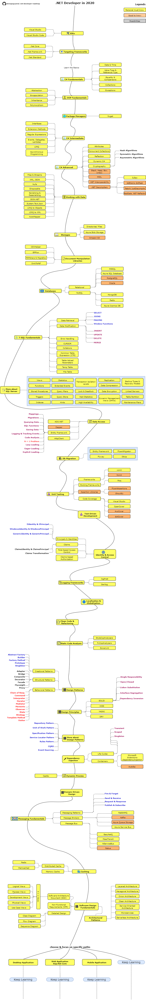
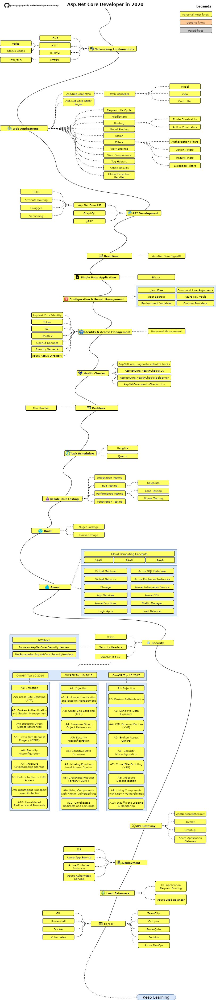

## .Net Developer Roadmap ([*edit on draw.io*](https://www.draw.io/#Uhttps%3A%2F%2Fraw.githubusercontent.com%2Fphongnguyend%2FPractical.NET%2Fmaster%2F.net-developer-roadmap.xml))

## Asp.Net Core Developer Roadmap ([*edit on draw.io*](https://www.draw.io/#Uhttps%3A%2F%2Fraw.githubusercontent.com%2Fphongnguyend%2FPractical.NET%2Fmaster%2Faspnetcore-developer-roadmap.xml))

## Contribution

The roadmaps are built using [Draw.io](https://www.draw.io/).

To modify a specific roadmap, click on corresponding link below to open it in draw.io:
- [.Net Developer Roadmap](https://www.draw.io/#Uhttps%3A%2F%2Fraw.githubusercontent.com%2Fphongnguyend%2FPractical.NET%2Fmaster%2F.net-developer-roadmap.xml)
- [Asp.Net Core Developer Roadmap](https://www.draw.io/#Uhttps%3A%2F%2Fraw.githubusercontent.com%2Fphongnguyend%2FPractical.NET%2Fmaster%2Faspnetcore-developer-roadmap.xml)

Update the roadmap, save as .xml file and export the image as .png file.

## License
[MIT](https://github.com/phongnguyend/Practical.NET/blob/master/LICENSE)
